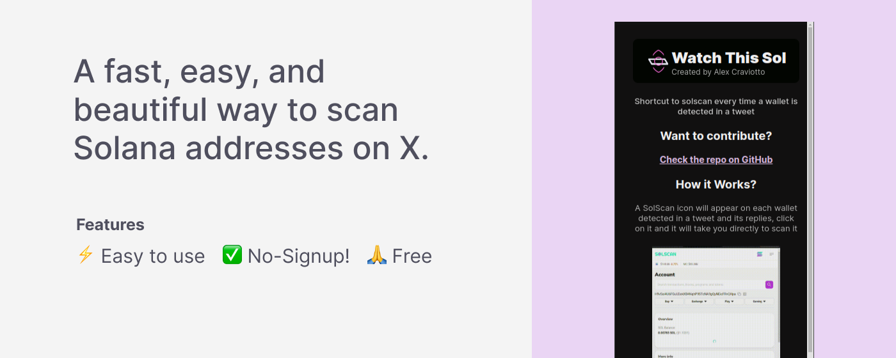
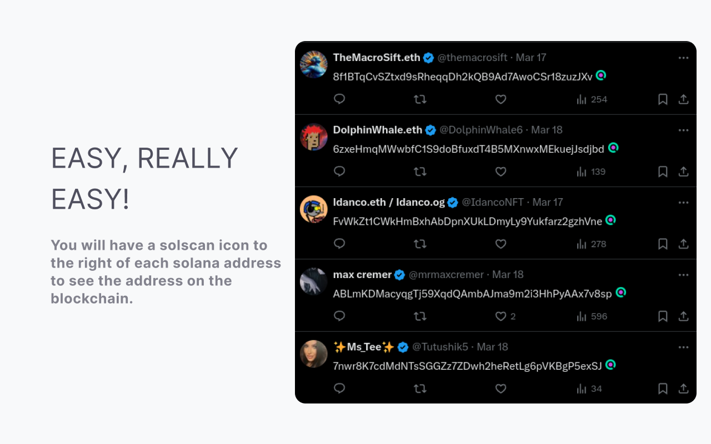

#### This extension scans your timeline tweets and replies for solana addresses, if found, a shortcut will be generated so you can quickly analyse them in solscan

## 👀 How works?

## 🔨 Contributing

Contributions are welcomed and appreciated! If you have any suggestions, find any issues, or want to contribute code, please feel free to:

- Open an issue to discuss potential changes or enhancements.
- Submit a pull request with improvements.

Let's make tracking Solana addresses on Twitter/X easier together!